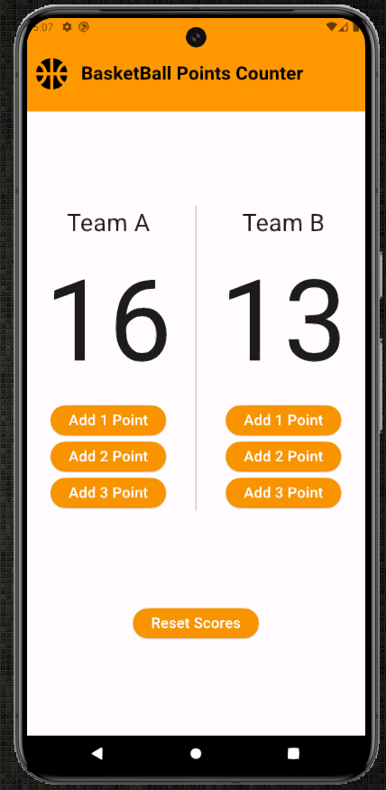

# BasketBall-Points-Counter
This Dart/Flutter code creates a basketball points counter app with a user interface that allows adding points to two teams and resetting the scores. 
# Basketball Points Counter

This repository contains a Flutter application for a Basketball Points Counter. The app allows users to add points to two teams and reset the scores. It features a simple and intuitive UI for easy interaction.

## Features

- **Team Score Tracking**: Add 1, 2, or 3 points to either Team A or Team B.
- **Real-Time Updates**: Scores update in real-time as points are added.
- **Reset Scores**: Reset the scores for both teams with a single button click.

## Screenshots



## Getting Started

### Prerequisites

- [Flutter](https://flutter.dev/docs/get-started/install) (version 2.0.0 or higher)

### Installation

1. Clone the repository:
    ```bash
    https://github.com/AlphaRareZ/BasketBall-Points-Counter.git
    ```
2. Navigate to the project directory:
    ```bash
    cd basketball-points-counter
    ```
3. Get the required packages:
    ```bash
    flutter pub get
    ```

### Running the App

To run the app on an emulator or a physical device, use the following command:
```bash
flutter run
```

## Usage

1. Launch the app on your device or emulator.
2. Use the buttons to add points to Team A or Team B.
3. Reset the scores using the "Reset Scores" button.

## Code Overview

### Main Code

The main application code is located in the `lib/main.dart` file.

- `pointsCounter`: A `StatefulWidget` that manages the state of the team scores.
- `_pointsCounterState`: Contains the logic to add points and reset the scores. The UI is built using Flutter widgets.

### Dependencies

- `flutter/material.dart`: Provides core Flutter widgets and material design components.

## Contributing

Contributions are welcome! Please open an issue or submit a pull request for any improvements or new features.

1. Fork the repository.
2. Create a new branch (`git checkout -b feature-branch`).
3. Commit your changes (`git commit -m 'Add some feature'`).
4. Push to the branch (`git push origin feature-branch`).
5. Open a pull request.

---

Enjoy using the Basketball Points Counter app! 🎉

---

Replace the placeholder text with your actual GitHub username and contact information, and add any necessary screenshots to the `screenshots` directory for better visual representation.